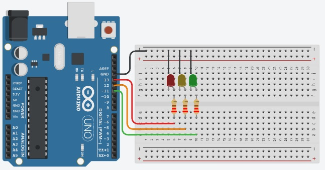

# Projeto Arduíno de semáforo de 3 luzes.

## Contextualização

Neste experimento faremos um semáforo de 3 luzes com três LEDs de forma que acendam e apaguem em sequência utilizando o pino digital 13 (pino digital incorporado LED_BUILTIN = 13), pino digital 12 e pino digital 11. 

## Esquema do projeto

## Projeto no Tinkercad

https://www.tinkercad.com/things/ljWziAcPcZ6